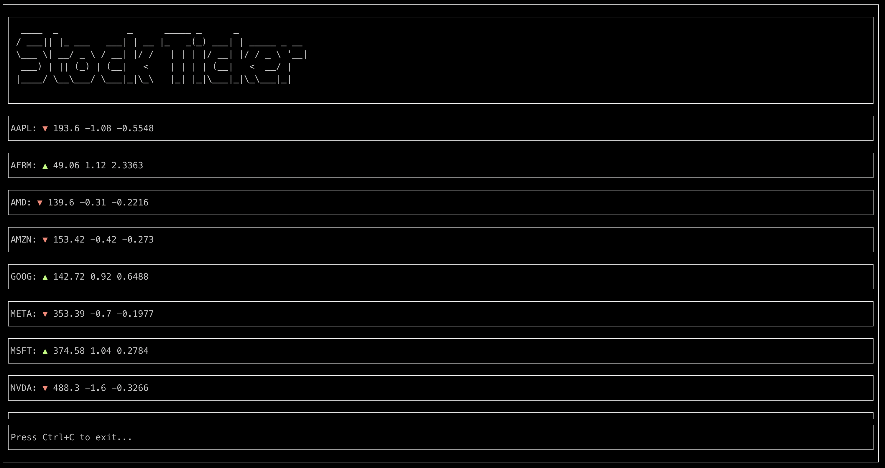
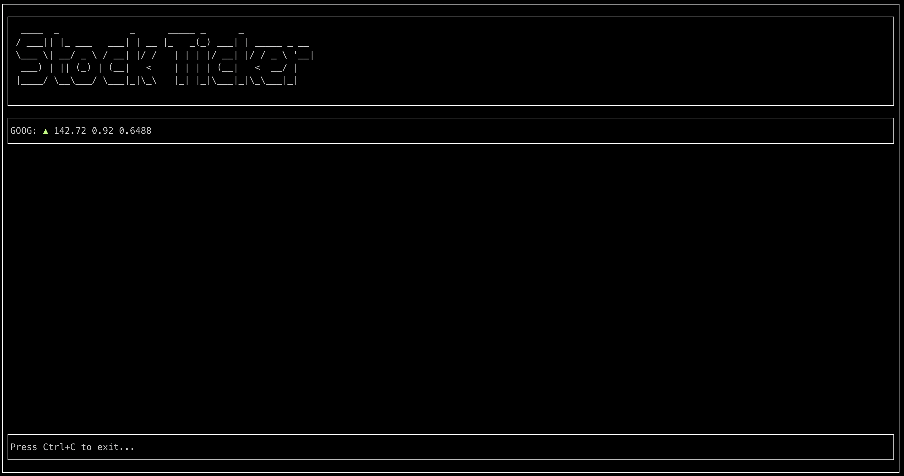

# stock-ticker

The Stock Ticker Console Program is a versatile and user-friendly command-line tool designed to provide real-time financial information. This application allows you to monitor and track the latest stock market data for your favorite companies, helping you make informed investment decisions.

[](https://www.npmjs.com/package/@barrymun/stock-ticker)

### Screenshots:





### To install:

(It is recommended to install npm and Node.js with [NVM](https://github.com/nvm-sh/nvm))

```bash
npm install @barrymun/stock-ticker -g
```

To run:

```bash
sticker -s GOOG META MSFT
```

Help

```bash
sticker -h
```

### TODO

- [x] Add app screenshots
- [ ] Handle terminal resizing
- [ ] Support for futures and ETFs
- [ ] Add a loading bar to show when the next request will be made
- [ ] Allow the user to specify if the stocks displayed should be listed in alphabetical order or in the order they were specified in the `sticker` command
